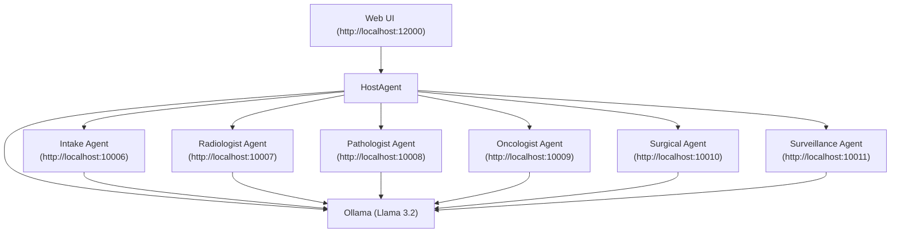

# Multi-Agent Clinical Reasoning System

This project is a multi-agent system designed to simulate a clinical workflow for cancer diagnosis and treatment planning. It features a main `HostAgent` that orchestrates tasks between several specialist "Doctor Agents," each running as a separate microservice. The system is managed and visualized through a web-based user interface.

All agents leverage a local Ollama instance running Llama 3.2, so no cloud API keys are required.

## System Architecture



This diagram shows how the Web UI communicates with the HostAgent, which orchestrates tasks between the specialist Doctor Agents. All agents interact with the local Ollama instance for AI-powered reasoning.

## Prerequisites

- Python 3.12+
- `pip` or `uv` for package installation
- An active Ollama instance with the `llama3.2` model pulled.

## 1. Installation

First, install the necessary Python dependencies for each component of the system. It is highly recommended to do this within a single Python virtual environment.

From the root directory of the project, run the following commands:

```bash
# Create and activate a virtual environment (optional but recommended)
python3 -m venv .venv
source .venv/bin/activate

# Install all dependencies
pip install -r ui/requirements.txt
pip install -r Host_agent/hosts/multiagent/requirements.txt
pip install -r DoctorAgents/Intake_Agent/requirements.txt
pip install -r DoctorAgents/Radiologist_agent/requirements.txt
pip install -r DoctorAgents/Pathologist_agent/requirements.txt
pip install -r DoctorAgents/Oncologist_Agent/requirements.txt
pip install -r DoctorAgents/Surgical_agent/requirements.txt
pip install -r DoctorAgents/Surveillance_agent/requirements.txt
```

## 2. Running the Application

The system requires multiple services to be running simultaneously. You must start all the specialist agents first, then start the user interface.

### Step 2.1: Start the Specialist Agents

Open a separate terminal window for each of the six specialist agents. Run the corresponding command in each terminal and leave it running.

**Terminal 1: Intake Agent**
- **File:** `DoctorAgents/Intake_Agent/__main__.py`
- **Command:** `python -m DoctorAgents.Intake_Agent`
- **Runs on:** `http://localhost:10006`

**Terminal 2: Radiologist Agent**
- **File:** `DoctorAgents/Radiologist_agent/__main__.py`
- **Command:** `python -m DoctorAgents.Radiologist_agent`
- **Runs on:** `http://localhost:10007`

**Terminal 3: Pathologist Agent**
- **File:** `DoctorAgents/Pathologist_agent/__main__.py`
- **Command:** `python -m DoctorAgents.Pathologist_agent`
- **Runs on:** `http://localhost:10008`

**Terminal 4: Oncologist Agent**
- **File:** `DoctorAgents/Oncologist_Agent/__main__.py`
- **Command:** `python -m DoctorAgents.Oncologist_Agent`
- **Runs on:** `http://localhost:10009`

**Terminal 5: Surgical Agent**
- **File:** `DoctorAgents/Surgical_agent/__main__.py`
- **Command:** `python -m DoctorAgents.Surgical_agent`
- **Runs on:** `http://localhost:10010`

**Terminal 6: Surveillance Agent**
- **File:** `DoctorAgents/Surveillance_agent/__main__.py`
- **Command:** `python -m DoctorAgents.Surveillance_agent`
- **Runs on:** `http://localhost:10011`

### Step 2.2: Start the User Interface

Once all six specialist agents are running, open a new terminal window.

**Terminal 7: Web UI**
- **File:** `ui/main.py`
- **Command:** `python ui/main.py`
- **Runs on:** `http://localhost:12000`

### Step 2.3: Manually Register Agents in the UI

After starting the UI, you must manually connect the central `HostAgent` to each specialist agent.

1.  Open your web browser and navigate to **[http://localhost:12000](http://localhost:12000)**.
2.  Find the **"Agents"** or **"Remote Agents"** tab in the UI.
3.  You will need to add each agent's address one by one. Use the "Register Agent" or similar feature and enter the following URLs:
    -   `http://localhost:10006`
    -   `http://localhost:10007`
    -   `http://localhost:10008`
    -   `http://localhost:10009`
    -   `http://localhost:10010`
    -   `http://localhost:10011`

After registering all six agents, you can navigate back to the main chat page and start a conversation. The `HostAgent` will now be able to find the specialist agents and orchestrate the clinical workflow correctly.